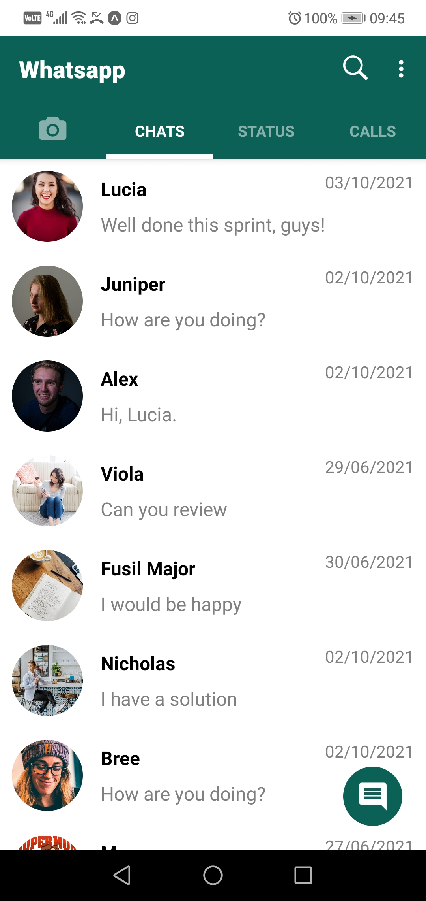

### star-wars-info

This project is a real-time chat application based on the whatsapp design, built using AWS Amplify and React-Native.




## Built With
- React-Native
- Typescript
- GraphQL
- Nodejs
- DynamoDB
- AWS Amplify

## Description
This project is a real-time chat application based on the whatsapp design, built using AWS Amplify and React-Native.


## Run server locally
Clone the git repo.

- To start the client, open the terminal and inside the project root folder type the following 
```
yarn install
yarn start
```


## Authors

👤 **Marylene Sawyer**
- Github: [@Bluette1](https://github.com/Bluette1)
- Twitter: [@MaryleneSawyer](https://twitter.com/MaryleneSawyer)
- Linkedin: [Marylene Sawyer](https://www.linkedin.com/in/marylene-sawyer-b4ba1295/)


# Acknowledgements

- The content in this repository was retrieved from or inspired by the following sites
  - [React-Native Documentation](https://reactnative.dev/docs/getting-started)
  - [Build a Realtime Chat App in React Native (tutorial for beginners)](https://www.youtube.com/watch?v=EvSUJ5lUcBw)

## Potential Future Improvements / Ambitions
- Review and add more display features
- Add more tabs such as the status screen

## 🤝 Contributing

Contributions, issues and feature requests are welcome!
